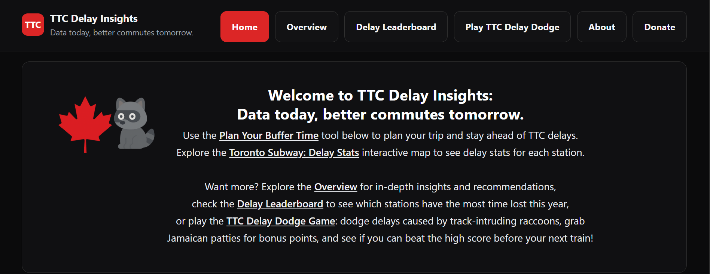
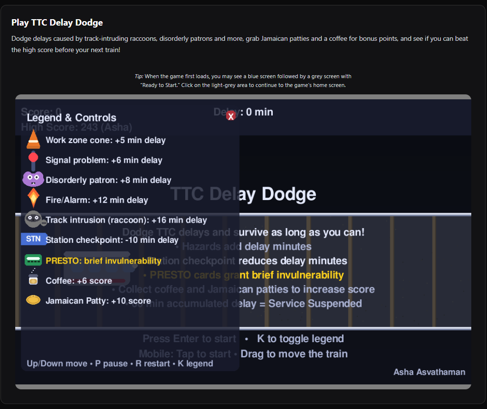

# SmartTransit: TTC Subway Delay Analysis

A comprehensive toolkit for analyzing Toronto Transit Commission (TTC) subway delay data.
This project provides cleaned datasets, classification systems, and analysis tools to understand operational inefficiencies,
safety risks, and other concerns across Toronto's subway system.

**Explore our analysis at [ttcdelayinsights.ca](https://ttcdelayinsights.ca)**


**Read the full story: [TTC Delay Insights: Data Today, Better Commutes Tomorrow](https://medium.com/@ashaasvathaman_14487/ttc-delay-insights-data-today-better-commutes-tomorrow-7aefca34bdbb)**

We also created a fun game, [TTC Delay Dodge](https://ttcdelayinsights.ca/ttcdelaydodge). 
Dodge real delay types (e.g., fires, signal problems, disorderly patrons) while grabbing coffee and Jamaican patties for extra points.
Think you can beat the highscore?


---

## Research Questions
This project explores Toronto's TTC subway delay data through three key areas:

### I. System-Wide Trends
- Has the number of minutes in delay increased over the years?
- Which types of delays cause the most total disruption?
- What are the most common causes of delays and have they changed over time?

### II. Root Cause & Infrastructure Analysis
- Signal issues: Are particular vehicles or train models consistently affected?
- Security incidents (by station): Are some stations seeing a rise over the years?
- Security incidents (by time): Are there time patterns (e.g., late-night spikes)?

### III. Spatial & Temporal Patterns
- Which stations experience the most frequent or severe delays?
- Which subway lines are most delay-prone?
- When do delays occur most often: during peak or off-peak hours?
- Which months have the most delays (e.g., winter-related issues)?

## Want to Dig into the Data Yourself?
In this repo we have:
- Raw TTC data: The bare-bones files the TTC provided, including delay data, subway system shapefiles, and delay codes
- Complete delay classification file: All 140+ delay codes with categories, technical reasoning, and public explanations
- Data cleaning scripts: Transform raw delay data into analysis-ready formats
- Data loader class: Easy-to-use tools for your own analysis
- Statistics generators: Generate comprehensive station, line, and delay-code-specific statistics as JSON files
- Jupyter notebook: Start exploring patterns immediately
- Visualization tools: Plotting functions in `utils/eda_utils.py` to generate and export charts (HTML + PNG)
---

## Quick Start

### Installation
```bash
# Clone the repository
git clone https://github.com/asvath/smarttransit.git
cd smarttransit

# Install dependencies
pip install -r requirements.txt
```

### Run the Preprocessing Pipeline
(Optional - only if you have additional new raw data. Analysis-ready data through Sep 2025 is available in `data/processed/delays`)
```bash
python pipelines/preprocess_pipeline.py
```

### Load and Explore Data
```python
from utils.ttc_loader import TTCLoader

# Initialize loader (automatically loads the most recent processed data)
loader = TTCLoader()

# Access the full dataset
df = loader.df

# Filter by category
df = loader.filter_category('Mechanical/Vehicle').df

# Filter by year
loader.clear_filters()
df_2024 = loader.filter_selected_year(2024).df

# Filter by date range (includes data from start year to end year)
loader.clear_filters()
df_2023_2025 = loader.filter_selected_years(2023, 2025).df

# Filter by station
loader.clear_filters()
station_data = loader.filter_selected_stations(['BLOOR-YONGE STATION', 'UNION STATION']).df

# Filter by line
loader.clear_filters()
yonge_line = loader.filter_line('YU').df

# Chain multiple filters
loader.clear_filters()
rush_hour_delays = loader.filter_selected_year(2024).filter_morning_rush_hour().filter_line('YU').df

# Access delay code mappings
code_to_description = TTCLoader.code_description_dict()
code_to_category = TTCLoader.code_category_dict()
category_to_reasoning = TTCLoader.category_reasoning_dict()
```

### Start Analyzing with Jupyter
```bash
jupyter notebook viz/TTC_EDA_Notebook.ipynb
```

The notebook comes pre-loaded with the TTCLoader and sample visualizations to get you started immediately.

---

### Generate Visualizations

Create and export analysis plots:
```python
import os
from utils.ttc_loader import TTCLoader
from viz.eda_plots import plot_total_delay_by_year, plot_total_delay_count_by_year, plot_avg_delay_time_by_year
from viz.eda_utils import fig_to_html
from config import EXPORTS_PLOTS_DIR

# Ensure export folder exists
os.makedirs(EXPORTS_PLOTS_DIR, exist_ok=True)

# Load data
loader = TTCLoader()
df = loader.df

# Generate and export plots
# Total delay by year (in days)
title = "total_delay_by_year"
fig = plot_total_delay_by_year(df, "days")
fig_to_html(fig, EXPORTS_PLOTS_DIR, title)
fig.write_image(f"{EXPORTS_PLOTS_DIR}/{title}.png", scale=2, width=1200, height=700)

# Total delay count by year
title = "total_delay_count_by_year"
fig = plot_total_delay_count_by_year(df)
fig_to_html(fig, EXPORTS_PLOTS_DIR, title)
fig.write_image(f"{EXPORTS_PLOTS_DIR}/{title}.png", scale=2, width=1200, height=700)

# Average time lost per delay
title = "avg_time_lost_per_delay_by_year"
fig = plot_avg_delay_time_by_year(df, "minutes", "line")
fig_to_html(fig, EXPORTS_PLOTS_DIR, title)
fig.write_image(f"{EXPORTS_PLOTS_DIR}/{title}.png", scale=2, width=1200, height=700)
```

Plots are saved as both interactive HTML files and static PNG images in the exports directory.

### Generate Statistics

Generate comprehensive statistics and export them as JSON files:
```python
from exports.generators.generate_stats import generate_stats

# Generates all statistics and saves to JSON files in the exports directory
generate_stats()
```

This creates the following statistics files:

**Station Statistics:**
- `stations_stats.json` - Comprehensive stats for each station (latest complete year)
  - Total delays and time lost
  - Number of major delays (>20min)
  - Percentage of system-wide delays
  - Top delay reasons by count and time lost

- `leaderboard_stations_stats.json` - Real-time stats for the current year (even if incomplete)

**Delay Code Specific Statistics:**
- `code_specific_stats.json` - Track patterns for specific delay codes across years
  - Stations consistently in top N for given delay codes
  - Average delay per incident, count per year, time lost per year
  - Includes: Track Intrusion, Disorderly Patron, Fire incidents

**Line Statistics:**
- `line_stats.json` - Performance metrics per subway line, bound, and time window
  - Total delays and average delay duration
  - Probability of experiencing at least one delay
  - 90th-percentile delay count
  - Recommended buffer time to add to travel time

All statistics are saved to the directory specified in `config.EXPORTS_STATS_DIR`.

## Project Structure
```
SmartTransit/
│
├── data/
│   ├── raw/
│   │   ├── code_descriptions/
│   │   │   ├── ttc-subway-delay-codes.xlsx
│   │   │   └── Code Descriptions.csv
│   │   ├── delays/
│   │   │   ├── ttc-subway-delay-data-2018.xlsx
│   │   │   ├── ttc-subway-delay-data-2019.xlsx
│   │   │   └── ...
│   │   ├── docs/
│   │   │   ├── ttc-subway-delay-data-readme.xlsx
│   │   │   ├── ttc_subway_stations.txt
│   │   │   ├── ttc_subway_stations_with_linecodes.txt
│   │   │   └── ttc_subwayway_geodata.json
│   │   └── dropped_raw/
│   ├── interim/
│   └── processed/
│       ├── code_descriptions/
│       │   └── TTC_Delay_Codes_Categories_and_Reasoning.csv
│       └── delay/
│           └── YYYY-MM-DD/
│
├── logs/
├── pipelines/
│   ├── build_station_geodata.py
│   ├── preprocess_pipeline.py
│   ├── preprocess_dataframe.py
│   ├── process_delay_code.py
│   └── ...
│
├── utils/
│   ├── cleaning_utils.py
│   ├── ttc_loader.py
│   └── ...
│
├── viz/
│   ├── TTC_EDA_Notebook.ipynb
│   ├── eda_plots.py
│   ├── eda_utils.py
│   └── ...
│
├── exports/
│   ├── generators/
│   │   ├── generate_stats.py
│   │   ├── station_stats.py
│   │   ├── line_stats.py
│   │   └── ...
│   ├── plots/
│   └── stats/
│
├── config.py
├── requirements.txt
└── README.md
```

## Key Folders & Files

- **data/raw/code_descriptions/** - Raw delay code files and descriptions
- **data/raw/delays/** - Raw TTC subway delay Excel files (2018–2025)
- **data/raw/docs/** - Official TTC documentation and manually created station reference files
- **data/raw/dropped_raw/** - CSVs of raw data dropped during cleaning (for transparency/debugging)
- **data/interim/** - Partially cleaned or in-progress data
- **data/processed/** - Final cleaned datasets, ready for analysis
- **logs/** - Logs of cleaning steps and errors
- **pipelines/** - Main data cleaning and processing scripts
- **utils/** - Utility Python modules (for loading, cleaning, etc.)
- **config.py** - Project and pipeline configuration file
- **requirements.txt** - Python dependencies

### Reference Files

**ttc_subway_stations_with_linecodes.txt** (in `data/raw/docs/`)  
Manually created list of all valid operational subway stations with their line codes. Used in the preprocessing pipeline
to standardize and validate station names, and categorize stations as passenger, non-passenger, or unknown.

**ttc_subway_geodata.json** (in `data/raw/docs/`)  
Contains all valid operational subway stations with their latitude/longitude coordinates.
Generated by `pipelines/build_station_geodata.py`, which extracts geodata from OpenStreetMap (OSM).
Some stations are added manually when not available in OSM.

---

## Data Cleaning & Preprocessing

### Raw Data Overview

The raw TTC dataset consists of:
- Excel files containing subway delay event data (2018 – Sep 2025)
- Delay code files mapping codes to event descriptions
  - `Code Descriptions.csv` - Primary file used (contains more comprehensive codes)
  - `ttc-subway-delay-codes.xlsx` - Not used (contains SRT codes which are excluded from this analysis)
- TTC-provided README file with column names and descriptions

### Preprocessing Pipeline

The preprocessing pipeline (`pipelines/preprocess_pipeline.py`) performs the following steps:

#### 1. Clean Delay Codes & Descriptions
- Process `Code Descriptions.csv` (TTC-provided file with comprehensive delay codes)
- Remove non-ASCII characters from delay code descriptions
- Output a cleaned mapping for consistent downstream use
- Output: `data/raw/code_descriptions/Clean Code Descriptions.csv`
- Note: `ttc-subway-delay-codes.xlsx` is not used as it contains SRT codes excluded from this analysis

#### 2. Merge & Clean Raw Delay Data
- Merge all raw TTC delay files into a single dataframe
- Log file names used for the merge and any errors
- Drop rows where:
  - Any key column (Min delay, Min Gap, Vehicle) is missing or zero
  - Min Gap < Min delay (gap between trains should exceed the delay)
  - Duplicate rows exist
- Write dropped data to `data/raw/dropped_raw/`

#### 3. Standardize Station Names
- Remove embedded line codes (e.g., "YU", "BD") from station names
- Standardize abbreviations (e.g., "St" → "St.")
- Correct spelling errors
- Ensure all passenger station names end with "STATION" (unless they end with YARD, HOSTLER, WYE, POCKET, TAIL, or TRACK, which are legitimate non-passenger station endings)
- Standardize naming for dual-line interchange stations (e.g., "BLOOR-YONGE", "SHEPPARD-YONGE")

#### 4. Station Categorization
Tag stations as:
- **passenger** - Listed in the valid operational stations file
- **non-passenger** - Ending with yard/hostler/etc.
- **unknown** - Cannot be matched (e.g., SRT, severe typos, directional suffixes)

Drop all unknown and non-passenger stations from analysis and write them to `data/raw/dropped_raw/`

#### 5. Validate Delay Codes
- Ensure all delay codes match the cleaned delay code mapping
- Set invalid codes to NaN (spelling errors where correct code is unknown)

#### 6. Validate Bound (Direction)
- For valid passenger stations, verify the direction (Bound) matches the station's subway line
- Example: ROSEDALE STATION (YU line) with "E" direction is invalid (YU only has N/S)
- Set invalid directions to NaN

#### 7. Clean & Standardize Date/Time
- Standardize all date and time columns as strings
- Combine into a new DateTime column as pandas datetime objects
- Enables hour, weekday, and time-based analysis

#### 8. Correct Day of Week
- Recompute Day field using the DateTime column to ensure accuracy

#### 9. Add Derived Features
- **IsWeekday** - Boolean (True/False)
- **Rush Hour** - Categorical ("Morning", "Evening", "Off Peak: Afternoon", "Off Peak: Night", "Weekend")
- **Season** - Categorical ("Winter", "Spring", "Summer", "Fall")
- **Delay Category** - Categorical ("Patron", "Mechanical/Infrastructure", etc.)
- **Delay Description** - Human-readable description based on delay code

#### 10. Final Validation & Output
- Drop any remaining invalid rows after cleaning
- Log all cleaned stations by category for manual review
- Write final cleaned dataset to `data/processed/delays/YYYY-MM-DD/cleaned_delay_data_YYYY-MM-DD-HH_MM_SS.csv`

### How to Run

Ensure your working directory is set to the project root (`SmartTransit/`).

Run the preprocessing pipeline:
```bash
python pipelines/preprocess_pipeline.py
```

**Output files:**
- `data/processed/delays/YYYY-MM-DD/cleaned_delay_data_YYYY-MM-DD-HH_MM_SS.csv`
- `data/raw/code_descriptions/Clean Code Descriptions.csv` (requires further manual processing)
- Manually processed file available at: `data/processed/code_descriptions/TTC_Delay_Codes_Categories_and_Reasoning.csv`

---

## Delay Code Classification

### Purpose

The TTC maintains detailed subway delay codes that describe specific causes of service disruptions. 
While these codes are highly precise, they use technical jargon that can be difficult to interpret.

By grouping individual codes into broader, standardized categories, we can:

- **Identify trends** - Track which types of issues (e.g., Mechanical/Infrastructure, Patron, Weather) cause the most delays over time
- **Simplify communication** - Replace technical jargon with clear, high-level categories easier for the public and media to understand
- **Enable reusability** - Allow researchers, journalists, and advocates to use this work without deciphering the TTC's internal code system

This classification system transforms operational delay data into an actionable tool for both internal analysis and public communication.

---

### Classification System

We manually classified all delay codes in `data/raw/code_descriptions/Clean Code Descriptions.csv` into the following categories:

- **Mechanical/Vehicle** - Faults or issues with the train itself (propulsion, brakes, HVAC, doors, onboard electronics, etc.)
- **Mechanical/Infrastructure** - Failures of transit infrastructure (track, signals, power systems, etc.)
- **Patron** - Incidents caused by customers (medical emergencies, disorderly conduct, trespassing, vandalism, alarm activation, etc.)
- **Weather** - Delays due to natural events (snow, ice, etc.)
- **Operational/Process** - Staff/operator errors, procedural mistakes, operational decisions, maintenance errors
- **Planned Work** - Scheduled closures and construction
- **Unplanned Work** - Closures due to unplanned work
- **Other/Internal** - Labour disputes, assault involving staff, fire inside TTC property, etc.
- **Other/External** - Delays caused by outside parties or events beyond TTC's direct control (external power failure, contractor issues, etc.)
- **Other/Unknown** - Cause cannot be determined due to insufficient detail

---

### Output File

**TTC_Delay_Codes_Categories_and_Reasoning.csv** (in `data/processed/code_descriptions/`)

This file contains the complete classification with the following fields:

- **Code** - The TTC delay code identifier
- **Code Description** - The official description from TTC logs
- **Category** - Assigned classification
- **Reasoning** - Technical explanation of why the code fits that category
- **Public Explanation** - Plain-language explanation of the delay suitable for public communication

**Example:** The code "EUCO: Couplers" is classified as **Mechanical/Vehicle**, with the technical reasoning: *"Connectors that join train cars and allow electrical systems to pass between them,"* and the public explanation: *"Connectors between train cars not working properly."*

---

### Sample Classifications

| CODE | DESCRIPTION | CATEGORY | REASONING | PUBLIC EXPLANATION |
|------|-------------|----------|-----------|-------------------|
| EUAC | AIR CONDITIONING | Mechanical/Vehicle | Air conditioning system that cools the train | Air conditioning issue on the train |
| EUAL | ALTERNATING CURRENT | Mechanical/Vehicle | Electrical system/converter that powers the train's motors, lights, and onboard equipment | Issue with electrical system/converter that powers the train's motors, lights, and onboard equipment |
| EUATC | ATC RC&S EQUIPMENT | Mechanical/Infrastructure | Automatic Train Control- Rail Control & Signalling system that manages train spacing, speed, and safety using trackside signals | Automatic train control (ATC) / signals equipment issue |
| EUBK | BRAKES | Mechanical/Vehicle | Brake system | Brake system issue on the train |
| EUBO | BODY | Mechanical/Vehicle | The physical frame of subway car | Issue with the train body or shell |
| EUCA | COMPRESSED AIR | Mechanical/Vehicle | Air-powered system that operates brakes, doors, and other equipment on the train | Issue with compressed air system that operates brakes/doors |
| EUCC | CAM CONTROL | Mechanical/Vehicle | Older type of train motor control that uses mechanical cams to adjust power | Older train control equipment issue |

---

## Data Sources
- **TTC Subway Delay Data**: [City of Toronto Open Data Portal](https://open.toronto.ca/)
- **OpenStreetMap**: Station geodata extracted via `build_station_geodata.py`

**Attribution**: This project uses publicly available data from the Toronto Transit Commission via the City of Toronto's Open Data Portal.

---

## Use Cases
This toolkit provides cleaned TTC delay data and analysis tools for anyone interested in transit system performance,
urban transportation research, data-driven advocacy, etc.

Feel free to use this work in your own analysis, reporting, or research. 
If you do, a citation or link back to this repository is appreciated! :) 

---

## Contributing
Contributions are welcome!
If you find issues with the data cleaning pipeline,
have suggestions for additional features, or want to add new analysis tools,
please open an issue or submit a pull request.


---

## License

MIT License - see [LICENSE](LICENSE) file for details

---
